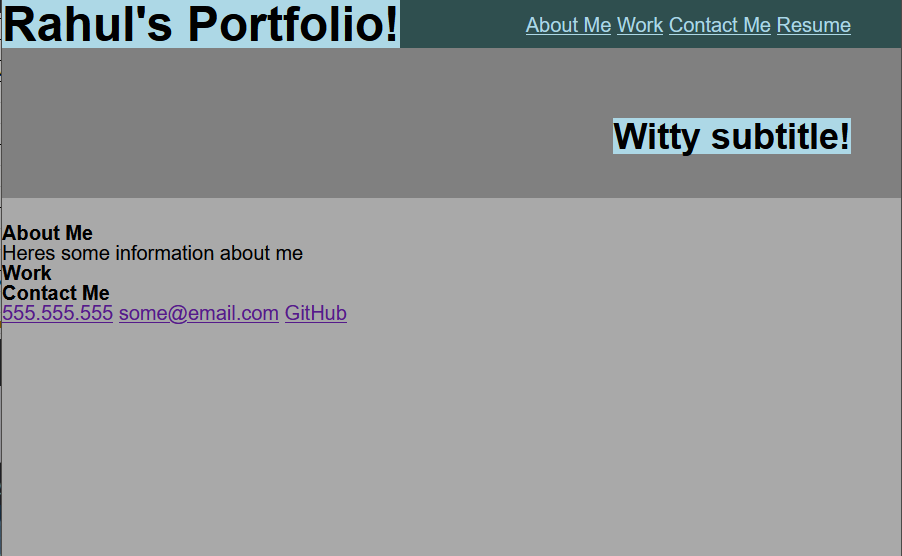

This project contains a personal portfolio containing HTML and CSS only built by hand.
Using knowledge learned from the course such as CSS styling, psuedo element/classes and flexbox.

Link to deployed application: https://r-basu.github.io/r-portfolio/

